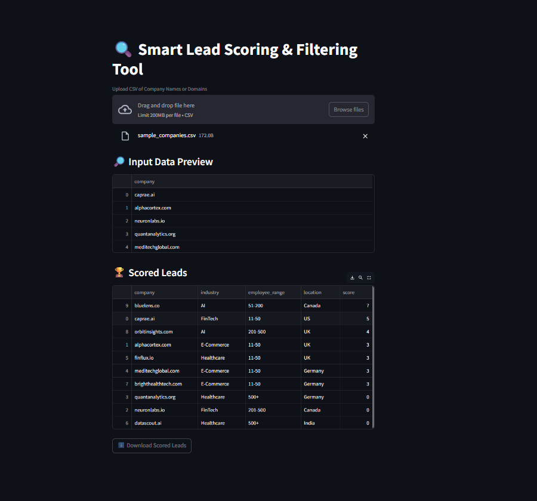

# 🔍 Caprae Lead Scoring Tool

This is a 5-hour mini-project built as part of the AI-Readiness Pre-Screening Challenge by **Caprae Capital**.

The goal of this tool is to help sales and investment teams **prioritize high-value leads** using lightweight enrichment and lead scoring logic — tailored for SaaS and AI companies.

---

## 🚀 Features

- 📥 Upload a CSV of company names/domains
- 🧠 Enriches each lead with mock attributes:
  - Industry
  - Employee range
  - Location
- 🏆 Applies scoring logic to rank leads by relevance
- 📊 Displays a scored table and allows CSV export
- 💡 Clean UI built with Streamlit

---


## 📸 Demo

[https://youtu.be/your-demo-video-link-here](https://youtu.be/_CmXf26iUGg)

> *(Replace the link above with your Loom or YouTube video)*

---

## 📁 Project Structure

smart_lead_filter/
├── app.py # Main Streamlit app
├── requirements.txt
├── README.md # This file
├── report.md # 1-page rationale
├── data/
│ └── sample_companies.csv # Example input
├── utils/
│ ├── enrichment.py # Mock enrichment logic
│ └── scoring.py # Lead scoring function

yaml
Copy
Edit

---

## 🧠 Scoring Logic

Each company is scored based on:
- ✅ Industry relevance (AI, SaaS)
- 👥 Ideal company size (11–200 employees)
- 🌎 Location (e.g., based in the US)

This reflects typical outbound sales criteria to find qualified and investable leads.

---

## 📦 Setup & Run Locally

1. **Clone the repo**
```bash
git clone https://github.com/SauravBedse223/caprae-lead-scoring-tool.git
cd caprae-lead-scoring-tool
Install dependencies

bash
Copy
Edit
pip install -r requirements.txt
Run the app

bash
Copy
Edit
streamlit run app.py
📤 Input Format
Upload a CSV file with the following structure:

csv
Copy
Edit
company
caprae.ai
neuronlabs.io
alphacortex.com
📥 Output
Scored and enriched table view

Downloadable as scored_leads.csv

